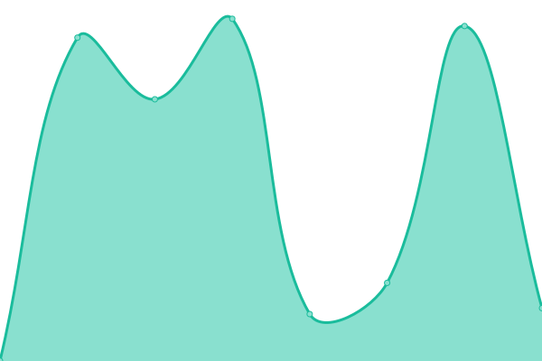

# [📈 Live Status](https://uptime.justinzwick.com): <!--live status--> **🟧 Partial outage**

This repository contains the open-source uptime monitor and status page for [Justin Zwick](https://uptime.justinzwick.com), powered by [Upptime](https://github.com/upptime/upptime).

With [Upptime](https://upptime.js.org), you can get your own unlimited and free uptime monitor and status page, powered entirely by a GitHub repository. We use [Issues](https://github.com/justinzwick/uptimemonitor/issues) as incident reports, [Actions](https://github.com/justinzwick/uptimemonitor/actions) as uptime monitors, and [Pages](https://uptime.justinzwick.com) for the status page.

<!--start: status pages-->
<!-- This summary is generated by Upptime (https://github.com/upptime/upptime) -->
<!-- Do not edit this manually, your changes will be overwritten -->
<!-- prettier-ignore -->
| URL | Status | History | Response Time | Uptime |
| --- | ------ | ------- | ------------- | ------ |
|  [Justin Zwick](https://justinzwick.com) | 🟩 Up | [justin-zwick.yml](https://github.com/justinzwick/uptimemonitor/commits/HEAD/history/justin-zwick.yml) | 

 383ms
     
 | 

<a href="https://uptime.justinzwick.com/history/justin-zwick">100.00%</a>
    

|  [SEO Analyzer](https://seoanalyzer.io) | 🟥 Down | [seo-analyzer.yml](https://github.com/justinzwick/uptimemonitor/commits/HEAD/history/seo-analyzer.yml) | 

 433ms
     
 | 

<a href="https://uptime.justinzwick.com/history/seo-analyzer">88.22%</a>
    

|  [SEO Gadgetry](https://seogadgetry.com) | 🟥 Down | [seo-gadgetry.yml](https://github.com/justinzwick/uptimemonitor/commits/HEAD/history/seo-gadgetry.yml) | 

 350ms
     
 | 

<a href="https://uptime.justinzwick.com/history/seo-gadgetry">88.24%</a>
    

|  [Data Chapel](https://datachapel.com) | 🟥 Down | [data-chapel.yml](https://github.com/justinzwick/uptimemonitor/commits/HEAD/history/data-chapel.yml) | 

 710ms
     
 | 

<a href="https://uptime.justinzwick.com/history/data-chapel">88.25%</a>
    

|  [Chattech](https://chattech.co) | 🟥 Down | [chattech.yml](https://github.com/justinzwick/uptimemonitor/commits/HEAD/history/chattech.yml) | 

 479ms
     
 | 

<a href="https://uptime.justinzwick.com/history/chattech">88.27%</a>
    

|  [MyTubeTech](https://mytubetech.com) | 🟥 Down | [my-tube-tech.yml](https://github.com/justinzwick/uptimemonitor/commits/HEAD/history/my-tube-tech.yml) | 

 219ms
     
 | 

<a href="https://uptime.justinzwick.com/history/my-tube-tech">88.28%</a>
    

|  [WealthSavvy](https://wealthsavvy.net) | 🟥 Down | [wealth-savvy.yml](https://github.com/justinzwick/uptimemonitor/commits/HEAD/history/wealth-savvy.yml) | 

 520ms
     
 | 

<a href="https://uptime.justinzwick.com/history/wealth-savvy">88.30%</a>
    

|  [Peep My Links](https://peepmylinks.com) | 🟥 Down | [peep-my-links.yml](https://github.com/justinzwick/uptimemonitor/commits/HEAD/history/peep-my-links.yml) | 

 352ms
     
 | 

<a href="https://uptime.justinzwick.com/history/peep-my-links">88.30%</a>
    

|  [Word Supplier](https://wordsupplier.com) | 🟥 Down | [word-supplier.yml](https://github.com/justinzwick/uptimemonitor/commits/HEAD/history/word-supplier.yml) | 

 213ms
     
 | 

<a href="https://uptime.justinzwick.com/history/word-supplier">88.31%</a>
    

|  [Concise Strategists](https://concisestrategists.com) | 🟥 Down | [concise-strategists.yml](https://github.com/justinzwick/uptimemonitor/commits/HEAD/history/concise-strategists.yml) | 

 212ms
     
 | 

<a href="https://uptime.justinzwick.com/history/concise-strategists">88.31%</a>
    

|  [Oakhurst Metals](https://oakhurstmetals.com) | 🟩 Up | [oakhurst-metals.yml](https://github.com/justinzwick/uptimemonitor/commits/HEAD/history/oakhurst-metals.yml) | 

 1801ms
     
 | 

<a href="https://uptime.justinzwick.com/history/oakhurst-metals">100.00%</a>
    

<!--end: status pages-->

[**Visit our status website →**](https://uptime.justinzwick.com)

## 📄 License

- Powered by: [Upptime](https://github.com/upptime/upptime)
- Code: [MIT](./LICENSE) © [Justin Zwick](https://uptime.justinzwick.com)
- Data in the `./history` directory: [Open Database License](https://opendatacommons.org/licenses/odbl/1-0/)
